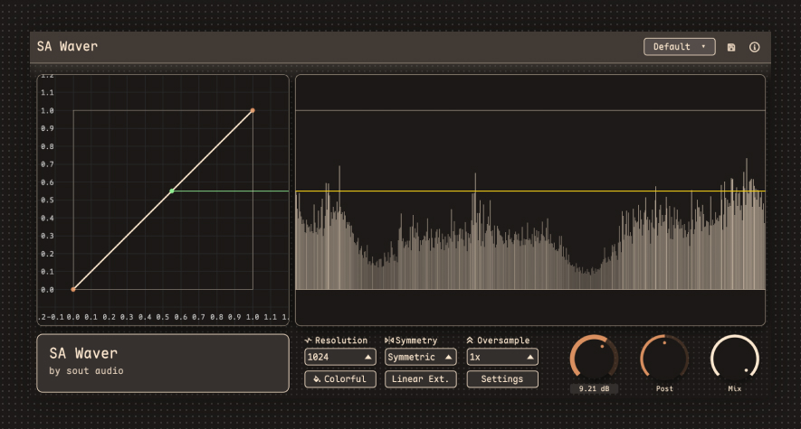

# SA_WAVER

`SA Waver` is a waveshaper distortion/saturation audio plugin built with Rust, `nih-plug`, and `egui`.  
It reshapes the input waveform through an editable transfer curve, making it useful for distortion, saturation, wave shaping, dynamic coloration, and automation-driven sound design.



## Features

- Fully editable waveshaper curve
- Real-time preview of the input/output mapping and output waveform
- Three core parameters: `Pre Gain`, `Post Gain`, and `Mix`
- Preset loading and saving
- Symmetric / asymmetric shaping modes
- Optional `Linear Ext.` mode
- Up to `8x` oversampling to reduce aliasing
- 8 host automation slots that can be bound to curve node coordinates
- Supports `VST3` and `CLAP`, plus a standalone build

## Basic Usage

1. Insert `SA Waver` on a track, bus, or sound source.
2. Use `Pre Gain` to push the signal into the shaping range.
3. Drag nodes in the curve editor to define the transfer function between input and output.
4. Use `Post Gain` to compensate output level, and `Mix` to blend dry and wet signal.
5. Increase `Oversample` if you want to reduce high-frequency aliasing artifacts.
6. Switch `Symmetry` when you want either mirrored shaping or independent negative-half processing.

## Interface Overview

- `Pre Gain`: input gain before the waveshaper
- `Post Gain`: output gain after shaping
- `Mix`: dry/wet balance
- Curve editor: defines how input values are mapped to output values
- Oscilloscope area on the right: shows recent output waveform history
- `Preset`: loads built-in or local presets
- `Linear Ext.`: extends the curve linearly beyond the last point instead of clamping
- `Oversample`: raises the internal sample rate to reduce aliasing
- `Settings`: opens additional display, grid, automation binding, and curve-generation options

## Shortcuts and Controls

### Parameter Knobs

- Drag with the mouse: adjust the parameter
- `Shift` + drag: fine adjustment
- Double-click a knob: reset to default
- `Ctrl` + click a knob: reset to default
- Click the value text: enter a value manually
- Press `Enter` while editing a value: confirm
- Press `Esc` while editing a value: cancel

### Curve Editing

- Left-drag a node: move the node
- Left-click empty space: clear the current selection
- Left-drag empty space: marquee-select multiple nodes
- `Ctrl` + left-click a node: add/remove it from the selection
- Middle-drag: pan the view
- `Delete` or `Backspace`: delete the selected node(s)


## Building

```shell
cargo xtask bundle sa_waver --release
```
